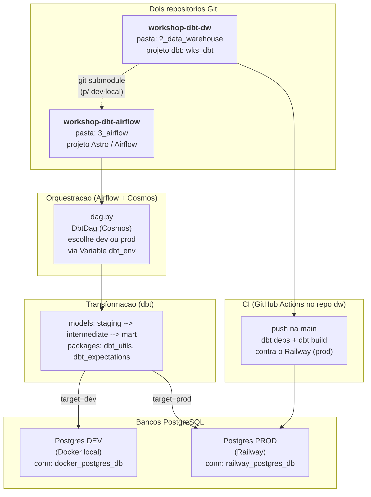
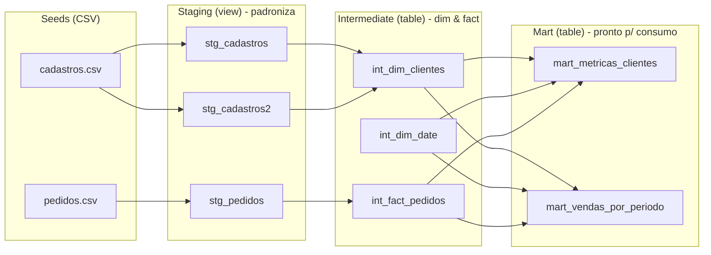
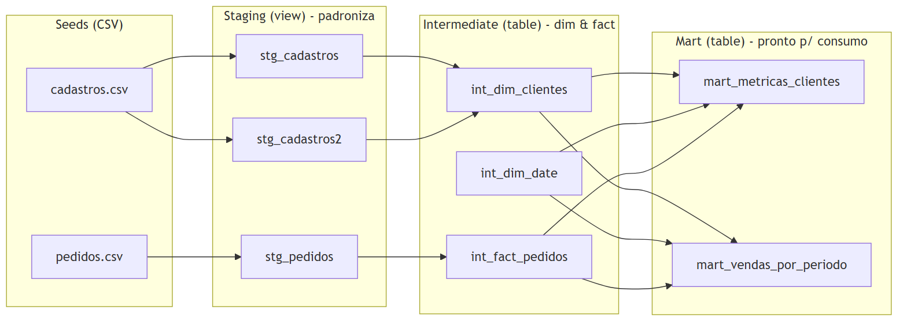
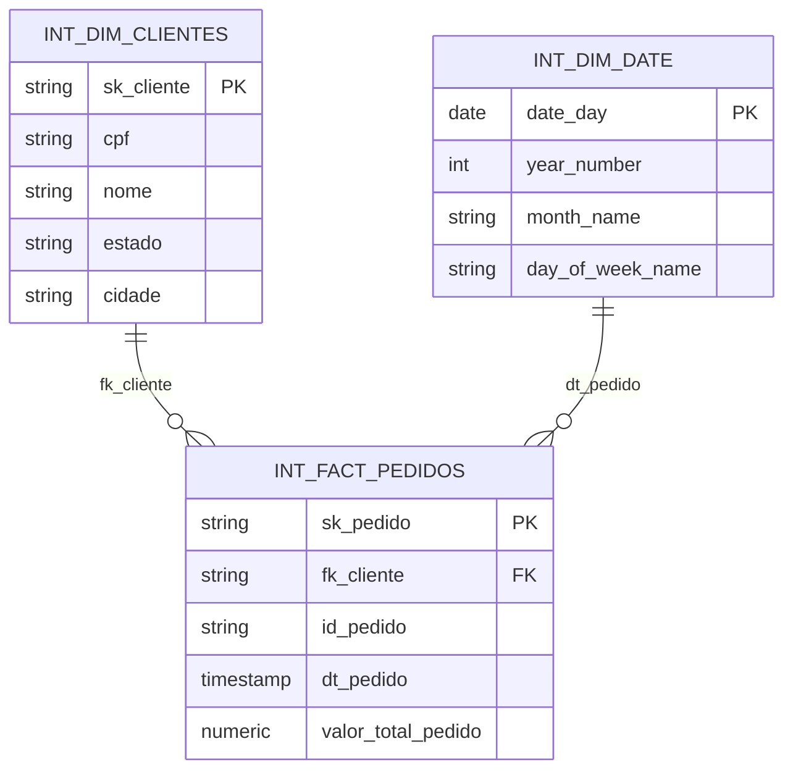
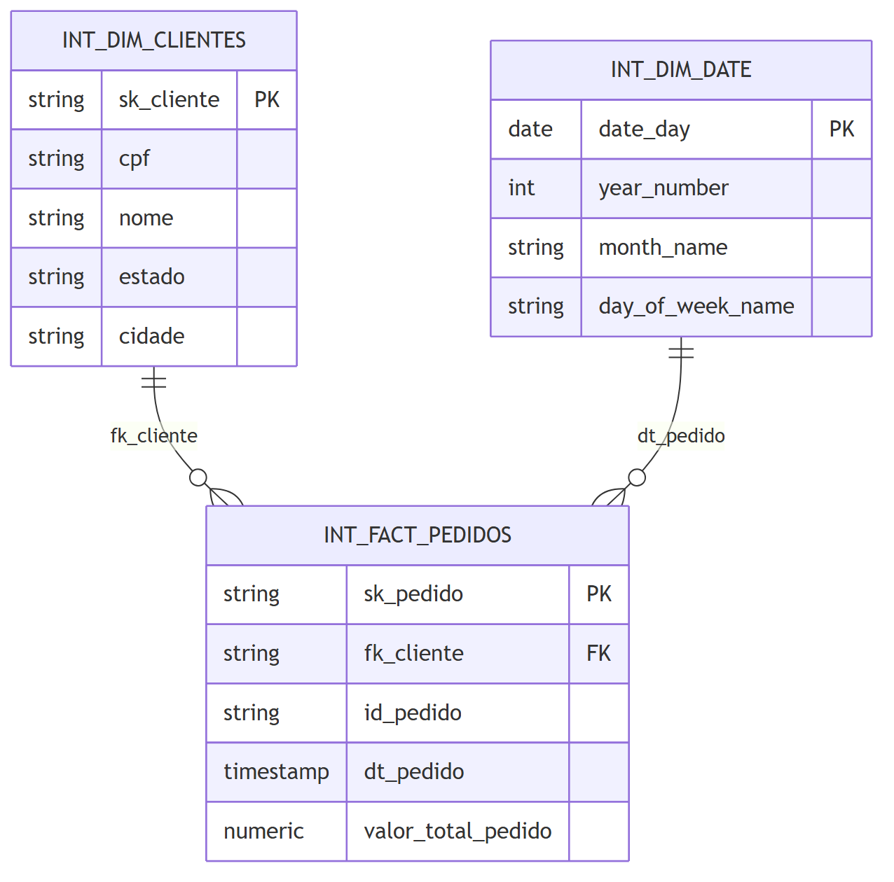
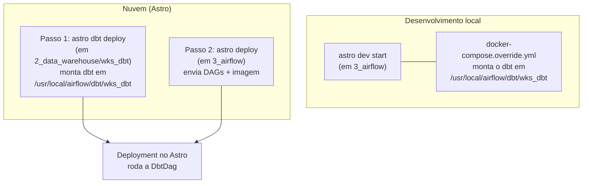
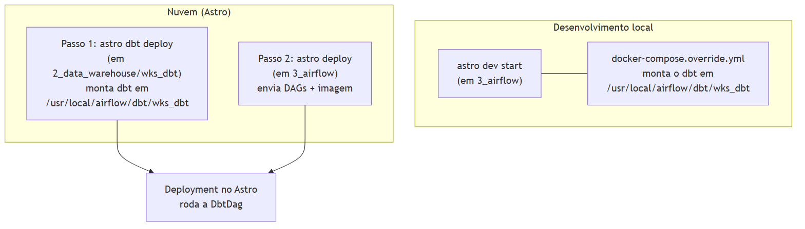

# 📊 Workshop dbt + Airflow — Documentação Completa do Projeto

Pipeline de dados ponta a ponta que **gera dados sintéticos**, **modela** com dbt (camadas
staging → intermediate → mart, em star schema) e **orquestra** com Airflow (Astronomer/Cosmos),
rodando em **PostgreSQL** local (dev) ou na nuvem via **Railway** (prod).

> Os diagramas são **Mermaid** + imagem **PNG** embutida. Renderizam no GitHub e no
> VS Code (extensão *Markdown Preview Mermaid Support*, atalho `Ctrl+Shift+V`).

## 📑 Índice
1. [Visão geral e objetivo](#1-visão-geral-e-objetivo)
2. [Stack de tecnologias](#2-stack-de-tecnologias)
3. [Arquitetura](#3-arquitetura)
4. [Estrutura de pastas](#4-estrutura-de-pastas)
5. [Etapa 1 — Setup local e geração de dados](#5-etapa-1--setup-local-e-geração-de-dados)
6. [Etapa 2 — Data Warehouse (dbt)](#6-etapa-2--data-warehouse-dbt)
7. [Etapa 3 — Orquestração (Airflow + Cosmos)](#7-etapa-3--orquestração-airflow--cosmos)
8. [Conexões e Variáveis](#8-conexões-e-variáveis)
9. [CI/CD](#9-cicd)
10. [Deploy na nuvem (Astro)](#10-deploy-na-nuvem-astro)
11. [Checklist de implementação](#11--checklist-de-implementação)
12. [Troubleshooting](#12-️-troubleshooting)

---

## 1. Visão geral e objetivo

O projeto é um **workshop de Engenharia de Analytics** que demonstra um fluxo completo:

```
gerar dados → carregar no Postgres → transformar com dbt → orquestrar com Airflow → deploy na nuvem
```

O domínio simulado é um **e-commerce**: clientes (`cadastros`) e suas compras (`pedidos`).
A partir desses dados crus, o dbt constrói um **modelo dimensional (star schema)** e duas
tabelas de consumo (*marts*): **segmentação RFM de clientes** e **vendas por período**.

O projeto é dividido em **3 etapas numeradas** (`1_local_setup`, `2_data_warehouse`, `3_airflow`),
cada uma sendo um passo do aprendizado.

---

## 2. Stack de tecnologias

| Camada | Tecnologia |
|--------|-----------|
| Geração de dados | Python, Faker (pt_BR), Pandas, NumPy, DuckDB |
| Banco (dev) | PostgreSQL 16 (Docker local, porta 5433) |
| Banco (prod) | PostgreSQL gerenciado na **Railway** |
| Transformação | **dbt** (dbt-core + dbt-postgres) |
| Pacotes dbt | dbt_utils, dbt_expectations, dbt_date |
| Orquestração | **Apache Airflow** via **Astronomer Runtime** + **Cosmos** |
| Deploy | Astro CLI (`astro deploy` + `astro dbt deploy`) |
| CI | GitHub Actions |
| Gerenciador de pacotes Python | `uv` (no setup local) |

> ⚠️ **Versões de dbt variam por ambiente:** setup local usa `dbt-core>=1.11`, o Airflow
> (Dockerfile) usa `dbt-postgres==1.9.0`, o CI fixa `dbt-core==1.9.4`, e a nuvem rodou `dbt=1.11`.
> Idealmente alinhar tudo numa versão só.

---

## 3. Arquitetura



> 📷 Imagem: [PNG](diagrams/01_arquitetura.png) · [SVG](diagrams/01_arquitetura.svg)
>
> 

---

## 4. Estrutura de pastas

```
wks_dbt_airflow/
├── 1_local_setup/                 # Geração de dados + Postgres local + documentação
│   ├── docker-compose.yml         # Postgres 16 (container dbt_postgres, porta 5433)
│   ├── generate_fake_data.py      # Gera cadastros/pedidos sintéticos → CSV
│   ├── pyproject.toml             # Deps (uv): faker, pandas, duckdb, dbt...
│   ├── README.md                  # README geral do projeto (ponto de entrada)
│   └── docs/                      # Documentação do projeto
│       ├── DOCUMENTACAO.md        # Este arquivo (referência)
│       ├── GUIA_DO_ALUNO.md       # Tutorial passo a passo
│       └── diagrams/              # Diagramas (.mmd, .png, .svg)
│
├── 2_data_warehouse/              # Repo Git: workshop-dbt-dw
│   ├── .github/workflows/dbt-ci.yml
│   └── wks_dbt/                    # Projeto dbt
│       ├── dbt_project.yml
│       ├── packages.yml
│       ├── seeds/                 # cadastros.csv, pedidos.csv
│       └── models/
│           ├── staging/           # stg_* (view)
│           ├── intermediate/      # dim/ e fact/ (table)
│           └── mart/              # marts de consumo (table)
│
├── 3_airflow/                     # Repo Git: workshop-dbt-airflow
│   ├── Dockerfile                 # Astro Runtime + dbt-postgres em venv
│   ├── requirements.txt           # astronomer-cosmos
│   ├── docker-compose.override.yml# Monta o dbt no container (dev local)
│   ├── .gitmodules                # Submódulo do repo dbt (HTTPS)
│   ├── dags/dag.py                # DbtDag (Cosmos)
│   └── dbt/workshop-dbt-dw/       # Submódulo → projeto dbt (dev local)
```

---

## 5. Etapa 1 — Setup local e geração de dados

Pasta **`1_local_setup`**. Responsável por preparar o ambiente de desenvolvimento.

### 5.1 Banco PostgreSQL local
`docker-compose.yml` sobe um Postgres 16:
- Container: `dbt_postgres` · Banco: `dbt_db` · Porta: **5433** (host) → 5432 (container)
- Usuário/senha vêm de variáveis de ambiente `DBT_USER` / `DBT_PASSWORD` (defina num `.env`)
- Healthcheck via `pg_isready`

### 5.2 Geração de dados sintéticos
`generate_fake_data.py` usa **Faker (pt_BR)** + **DuckDB** para gerar e exportar para CSV:
- **10.000 cadastros** (clientes) — nome, CPF, data de nascimento, contato, endereço
- **50.000 pedidos** — vinculados aos CPFs, com valor, frete, desconto, cupom, status, data
- `random.seed(42)` → dados **reproduzíveis**
- Saída: CSVs na pasta `seeds/` (consumidos pelo dbt). O DuckDB é só um buffer temporário (removido ao final).

> Os CSVs gerados viram os **seeds** do dbt: `cadastros.csv` e `pedidos.csv`.

---

## 6. Etapa 2 — Data Warehouse (dbt)

Pasta **`2_data_warehouse/wks_dbt`** (repo `workshop-dbt-dw`). Projeto dbt chamado **`wks_dbt`**.

### 6.1 Fluxo de dados (lineage)



> 📷 Imagem: [PNG](diagrams/02_fluxo_dados.png) · [SVG](diagrams/02_fluxo_dados.svg)
>
> 

### 6.2 Modelo dimensional (star schema)



> 📷 Imagem: [PNG](diagrams/04_modelo_dimensional.png) · [SVG](diagrams/04_modelo_dimensional.svg)
>
> 

### 6.3 Camadas e modelos

| Camada | Materialização | Modelo | O que faz |
|--------|----------------|--------|-----------|
| **staging** | `view` | `stg_cadastros` | Limpa/renomeia colunas dos cadastros (id→id_cliente, datas, etc.) |
| | | `stg_cadastros2` | Variação de staging de cadastros |
| | | `stg_pedidos` | Padroniza os pedidos |
| | | `stg_luciano` | Modelo extra de exercício |
| **intermediate** | `table` | `int_dim_clientes` | Dimensão de clientes; cria `sk_cliente` (surrogate key) |
| | | `int_dim_date` | Dimensão de tempo gerada via `dbt_date` (atributos de dia/semana/mês/trimestre/ano) |
| | | `int_fact_pedidos` | Fato de pedidos; `sk_pedido` via `dbt_utils.generate_surrogate_key`, join com dim_clientes (por CPF) e dim_date |
| **mart** | `table` | `mart_metricas_clientes` | **Segmentação RFM**: total gasto, ticket médio, recência, frequência, estação preferida, scores e segmento (Campeão, Cliente Fiel, Potencial, Em Risco de Churn, etc.) |
| | | `mart_vendas_por_periodo` | Vendas agregadas por dia: receita bruta, clientes únicos, ticket médio, **média móvel 7d**, variação e taxa de crescimento vs. dia anterior |

### 6.4 Pacotes, testes e variáveis
- **packages.yml:** `dbt-labs/dbt_utils` 1.3.0, `metaplane/dbt_expectations` 0.10.8 (o `dbt_date` entra como dependência).
- **Testes (~32):** `unique`, `not_null` nas chaves; `dbt_expectations.expect_column_values_to_be_between` nos valores monetários (0 a 1.000.000).
- **Variável de projeto:** `dbt_date:time_zone = America/Sao_Paulo` (no `dbt_project.yml`).
- **Documentação:** descrições de colunas em `_stg__models.yml`, `_int__models.yml`, `_mart__models.yml`.

### 6.5 Comandos dbt (rodando local)
```powershell
cd 2_data_warehouse\wks_dbt
dbt deps     # baixa os pacotes (dbt_utils, etc.)
dbt seed     # carrega os CSVs como tabelas
dbt run      # constrói os models (staging → intermediate → mart)
dbt test     # roda os testes de qualidade
dbt build    # faz seed + run + test de uma vez (recomendado)
```

---

## 7. Etapa 3 — Orquestração (Airflow + Cosmos)

Pasta **`3_airflow`** (repo `workshop-dbt-airflow`). Projeto **Astronomer** que roda o dbt via **Cosmos**.

### 7.1 A DAG (`dags/dag.py`)
- Usa **`DbtDag`** do Cosmos, que transforma o projeto dbt numa DAG (cada model vira uma task).
- **Switch de ambiente:** lê a Variable `dbt_env` (`dev`/`prod`); se inválida, falha com erro claro.
  - `dev` → conexão `docker_postgres_db` (Postgres local)
  - `prod` → conexão `railway_postgres_db` (Railway)
- **Schedule:** `@daily` · **start_date:** 2026-06-03 · **catchup:** `False` · **retries:** 2
- **dag_id dinâmico:** `dag_wks_dbt_dev` ou `dag_wks_dbt_prod`
- `dbt_project_path = /usr/local/airflow/dbt/wks_dbt`

### 7.2 Imagem (`Dockerfile`)
- Base: `astrocrpublic.azurecr.io/runtime:3.2-5`
- Instala o dbt num venv isolado: `pip install dbt-postgres==1.9.0`
- `requirements.txt`: `astronomer-cosmos==1.14.2` + provider do Postgres

### 7.3 Dev local
```powershell
cd 3_airflow
astro dev start      # sobe Airflow local; override monta o dbt em /usr/local/airflow/dbt/wks_dbt
astro dev restart    # reinicia após mudanças
```
O `docker-compose.override.yml` monta o submódulo do dbt nos containers `scheduler` e `dag-processor`.

---

## 8. Conexões e Variáveis

Configurar tanto **localmente** (UI do Airflow / `airflow_settings.yaml`) quanto **no Deployment da nuvem** (Astro Environment Manager).

| Recurso | Tipo | Detalhes |
|---------|------|----------|
| `dbt_env` | Variable | `dev` ou `prod` — controla qual banco a DAG usa |
| `docker_postgres_db` | Connection (Postgres) | Banco local: `dbt_db`, porta 5433, schema `public`. *Host* depende da rede do Docker (ex.: `host.docker.internal`) |
| `railway_postgres_db` | Connection (Postgres) | Banco Railway: host/porta/usuário/**senha**/db do painel Railway, schema `public` |

> ⚠️ Senha errada na `railway_postgres_db` gera `FATAL: password authentication failed for user "railway"`.

---

## 9. CI/CD

Arquivo **`2_data_warehouse/.github/workflows/dbt-ci.yml`** — roda a cada **push na `main`**:

```
checkout → setup Python 3.13 → pip install dbt → gera profiles.yml (secrets Railway)
         → dbt deps → dbt build (target=prod)
```

- **Secrets do GitHub necessários:** `RAILWAY_DB_HOST`, `RAILWAY_DB_USER`, `RAILWAY_DB_PASS`, `RAILWAY_DB_PORT`, `RAILWAY_DB_NAME`
- Valida que o projeto dbt builda e passa nos testes contra o banco de produção.

---

## 10. Deploy na nuvem (Astro)

**Dois deploys independentes** — esse é o ponto-chave do projeto:



> 📷 Imagem: [PNG](diagrams/03_deploy.png) · [SVG](diagrams/03_deploy.svg)
>
> 

> 🔑 **Regra de ouro:** o `dbt_project_path` da DAG, o mount local e o mount do
> `astro dbt deploy` apontam **todos** para `/usr/local/airflow/dbt/wks_dbt`
> (padrão do `astro dbt deploy`: `/usr/local/airflow/dbt/<nome-do-projeto-dbt>`).

```powershell
# 0) autenticar
astro login

# 1) deploy do dbt (a partir da pasta do projeto dbt)
cd 2_data_warehouse\wks_dbt
astro dbt deploy <deployment-id>

# 2) deploy do Airflow
cd 3_airflow
astro deploy
```

---

## 11. ✅ Checklist de implementação

### Fase 1 — Setup local
- [ ] Criar `.env` com `DBT_USER` / `DBT_PASSWORD`
- [ ] `docker compose up -d` em `1_local_setup` (sobe o Postgres na porta 5433)
- [ ] Instalar deps (`uv sync`) e rodar `python generate_fake_data.py`
- [ ] Conferir os CSVs gerados na pasta `seeds/`

### Fase 2 — Projeto dbt
- [ ] Copiar os seeds para `2_data_warehouse/wks_dbt/seeds/`
- [ ] Definir camadas no `dbt_project.yml` (staging view; intermediate/mart table)
- [ ] Declarar pacotes em `packages.yml` e rodar `dbt deps`
- [ ] Configurar `profiles.yml` (targets dev e prod)
- [ ] `dbt build` e validar models + testes
- [ ] ⚠️ `.gitignore`: `target/`, `dbt_packages/`, `logs/`, `package-lock.yml`

### Fase 3 — CI
- [ ] Criar `dbt-ci.yml` e cadastrar os secrets do Railway no GitHub
- [ ] Confirmar CI **verde**

### Fase 4 — Airflow
- [ ] `astro dev init` em `3_airflow`
- [ ] `Dockerfile`: instalar `dbt-postgres` em venv
- [ ] Adicionar o repo dbt como **submódulo** (URL em **HTTPS**)
- [ ] `docker-compose.override.yml`: montar o dbt em `/usr/local/airflow/dbt/wks_dbt`
- [ ] Escrever a `DbtDag` (paths, perfis dev/prod, switch `dbt_env`)
- [ ] Criar a Variable `dbt_env` e as Connections (`docker_postgres_db`, `railway_postgres_db`)
- [ ] `astro dev start` e validar a DAG na UI

### Fase 5 — Deploy na nuvem
- [ ] `astro login`
- [ ] `astro dbt deploy` (de `2_data_warehouse/wks_dbt`)
- [ ] `astro deploy` (de `3_airflow`)
- [ ] Cadastrar Connections/Variables **no Deployment**
- [ ] Rodar a DAG e validar ponta a ponta

---

## 12. 🛠️ Troubleshooting

| Erro | Causa | Solução |
|------|-------|---------|
| `packages.yml is malformed` / `not valid under any of the given schemas` | `package-lock.yml` versionado, gerado por outra versão de dbt (com chave `name`) | Remover do git e **gitignorar** o `package-lock.yml` |
| `Host key verification failed` (submódulo) | `.gitmodules` com URL **SSH**; build sem chave SSH | Trocar para **HTTPS** |
| `Could not find dbt_project.yml at /usr/local/airflow/dbt/wks_dbt` | `dbt_project_path` ≠ caminho de mount | Alinhar tudo em `/usr/local/airflow/dbt/wks_dbt` |
| `dbt project file not found at .../2_data_warehouse/dbt_project.yml` | `astro dbt deploy` na pasta errada | Rodar de `2_data_warehouse/wks_dbt` (ou `--project-path`) |
| `no context set, have you authenticated to Astro?` | CLI não logado | `astro login` |
| `password authentication failed for user "railway"` | Senha errada na Connection | Corrigir no Deployment do Astro |
| `this is not an Astro project directory` | Comando `astro` rodado fora de `3_airflow` | `cd 3_airflow` antes |

### Pendências menores conhecidas
- [ ] `_stg__models.yml` referencia `stg_cadastros_2`, mas o model se chama `stg_cadastros2` → ajustar o nome no `.yml` (gera o warning *"Did not find matching node for patch"*)
- [ ] Deprecation `MissingArgumentsPropertyInGenericTestDeprecation`: aninhar os args dos testes do `dbt_expectations` sob `arguments:`
- [ ] Alinhar a versão do dbt entre local / CI / Airflow / nuvem
